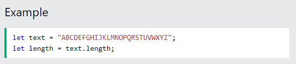
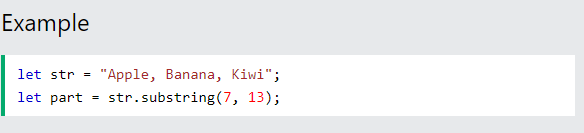
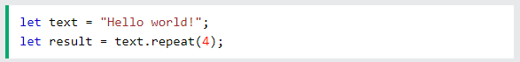

# Table of Contents
## 01-String
## 02-Number
### Что такое метод в JavaScript
Метод — это блок кода, который выполняется только при вызове.

Вы можете передавать данные, называемые параметрами, в метод.

Методы используются для выполнения определенных действий, их также называют функциями .
### СТРОЧНЫЕ МЕТОДЫ JAVASCRIPT

.png>)

### 1-"Double Quates"== "Hello"
### 2-'Single Quates'=='Hello'
### 3-`Backticks`==`Hello ${hi}`
## JAVASCRIPT STRING METHODS


```
                           String length( )
```

```
                           String charAt( )
```

```
                          String charCodeAt( )
```

```
                              String at( )
```

```
                                String[ ]
```

```
                             String slice( )
```

```
                           String substring( )
```

```
                         String toUpperCase( )
```

```
                         String toLowerCase( )
```

```
                            String concat( )
```

```
                             String trim( )
```

```
                            String repeat( )
```


```
                           String replace( )
```

```
                          String replaceAll( )
```

```
                            String split( )
```


## Описание Метод Math.ceil() округляет число, округленное в большую сторону, до ближайшего целого числа.


## Метод Math.floor() округляет число ВНИЗ до ближайшего целого числа.


## Метод Math.fround() возвращает ближайшее 32-битное представление числа с плавающей запятой одинарной точности.
